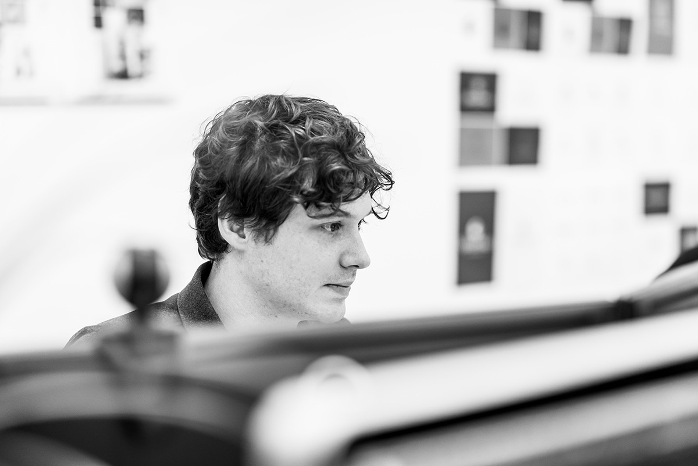

I'm a multidisciplinary designer with a love of creative arts, typography, and the world wide web, hailing from the lovely northern town of Lancaster. I now live and work in the substantially less town-like, but just as lovely (and northern) metropolis of Manchester.

I'm UX Designer at [Booking.com][5]'s ground transportation devision, BookingGo, where I'm working on rethinking the central tenets of what we would call a 'trip'.

Previously, I improved customers' car financing experience with the fine folks of [Zuto][1]. Prior to that, I helped improve hundreds of client's brands and customer-facing design both online and in print for the smashing chaps at [Fat Media][2].

## Get in touch

* [jake@jakeatkin.co.uk][3]
* [@theatkinator][4]

[0]: https://www.thomascookairlines.com
[1]: https://www.zuto.com
[2]: https://www.fatmedia.co.uk
[3]: mailto:jake@jakeatkin.co.uk
[4]: https://twitter.com/TheAtkinator
[5]: https://booking.com